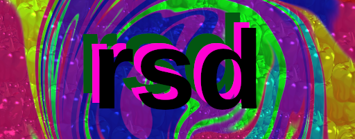

# rsd
<p align=center></p>
<p align=center>
	<a href="https://codeberg.org/obrigani/rsd"></a>
	<a href="https://spdx.org/licenses/GPL-3.0-only.html"></a>
</p>

rsd (rodent software distribution) is an attempt at making a somewhat secure minimal operating system with its own kernel and non-gnu userland applications.

## Installation
Currently, due to the fact that it's in alpha, the only way to get an image of the operating system is to compile it yourself
### Required software
 - i686-elf versions of gcc and binutils (see [compile instructions](./docs/crosscompiler.md))
 - bash
 - xorriso
 - gzip
 - curl
 - tar
 - GRUB (Optional, not yet implemented)
### Build process
Just run ```make dist``` and it should compile and give you an iso with default configs
